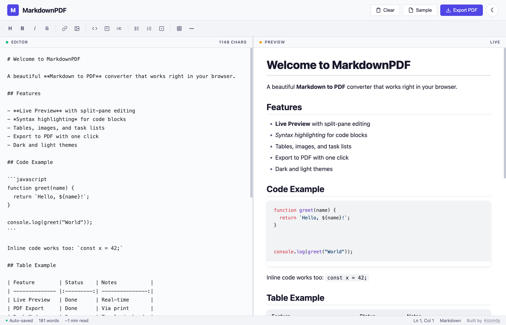

# MarkdownPDF

A beautiful, fully offline Markdown-to-PDF converter that runs entirely in your browser. No frameworks, no server, no setup — just open the HTML file and start writing.

---

## Features

- **Split View** — Live editor on the left, rendered preview on the right with synced scrolling
- **PDF Export** — One-click export via the browser's print function with clean print styles
- **Dark / Light Mode** — Toggle between themes, preference is saved automatically
- **Syntax Highlighting** — Code blocks with language-aware highlighting powered by highlight.js
- **Full Markdown Support** — Headers, bold, italic, strikethrough, links, images, blockquotes, tables, ordered/unordered lists, task lists with checkboxes, horizontal rules, and inline/fenced code blocks
- **Formatting Toolbar** — Quick-access buttons for all common Markdown elements
- **Auto-Save** — Content is saved to localStorage on every keystroke — nothing gets lost on refresh
- **Resizable Panes** — Drag the divider to adjust the editor/preview split
- **Status Bar** — Word count, character count, reading time, and cursor position at a glance

## How to Use

1. Download or clone this repository
2. Open `index.html` in any modern browser
3. Start writing Markdown — the preview updates in real time
4. Click **Export PDF** to save as PDF

That's it. No dependencies to install, no build step, no server required.

## Keyboard Shortcuts

| Shortcut | Action |
| --- | --- |
| `Ctrl/Cmd + B` | Bold |
| `Ctrl/Cmd + I` | Italic |
| `Ctrl/Cmd + K` | Insert link |
| `Ctrl/Cmd + H` | Insert heading |
| `` Ctrl/Cmd + ` `` | Inline code |
| `Ctrl/Cmd + S` | Force save |
| `Tab` | Insert indent |

## Tech Stack

- Vanilla HTML, CSS, and JavaScript
- [highlight.js](https://highlightjs.org/) via CDN for syntax highlighting
- Zero frameworks, zero build tools

## Browser Support

Works in all modern browsers — Chrome, Firefox, Safari, Edge.

## License

MIT

---

Built with care by [Aizondy](https://github.com/Aizondy)
